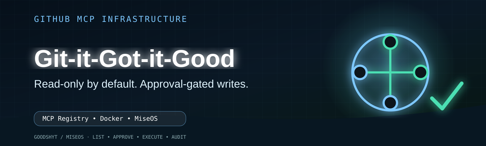

<p align="center">
  
</p>

# Git-it-Got-it-Good

<!-- badges -->
[](https://opensource.org/licenses/MIT)
[](https://nodejs.org)
[](https://www.typescriptlang.org/)
[](docker-compose.yml)

<!-- logo placeholder -->
<div align="center">


**Production-hardened GitHub MCP server for AI-assisted repository management**

*Read-only by default · Approval-gated writes · Audit-logged operations*

</div>

---

## 📖 Overview

Git Manager MCP is an approval-gated GitHub MCP (Model Context Protocol) server designed for safe AI-assisted repository operations. It follows a **blue system** operating model:

| Principle | Description |
|-----------|-------------|
| **Read-only by default** | No accidental mutations |
| **Narrow typed tools** | Predictable, auditable actions |
| **Explicit policy guard** | Every write requires approval |
| **Audit logging** | Full traceability of all tool calls |
| **Human-in-the-loop** | Destructive actions blocked without approval |

## ✨ Features

- 🔐 **OAuth authentication** with GitHub
- 📋 **Structured audit logs** for compliance
- 🚫 **Block destructive actions** (force push, repo deletion, secret writes)
- ⚡ **Rate limiting** per user and IP
- 🛡️ **Helmet security** headers
- 📊 **Health check endpoint** for monitoring
- 🐳 **Docker-ready** with multi-platform builds
- 🔒 **Approval tokens** for write operations

## 🚀 Quick Start

### Prerequisites

- Node.js ≥ 22.11.0
- Docker (optional, for containerized deployment)
- GitHub OAuth App credentials

### Local Setup

```bash
# Clone the repository
git clone https://github.com/DeontewattsV1/Git-it-Got-it-Good.git
cd Git-it-Got-it-Good

# Install dependencies
npm install

# Copy environment file
cp .env.example .env

# Start development server
npm run dev
```

### Verify Installation

```bash
# Health check
curl http://localhost:3000/health

# Type checking
npm run typecheck

# Linting
npm run lint
```

## 🐳 Docker Deployment

```bash
# Build and run with Docker Compose
docker-compose up --build

# Or build image manually
docker build -t git-manager-mcp .
docker run -p 3000:3000 --env-file .env git-manager-mcp
```

## ⚙️ Configuration

| Environment Variable | Default | Description |
|---------------------|---------|-------------|
| `PORT` | `3000` | Server port |
| `LOG_LEVEL` | `info` | Pino log level |
| `ALLOW_WRITES` | `false` | Enable write operations |
| `BLOCK_DESTRUCTIVE_ACTIONS` | `true` | Block dangerous ops |
| `REQUIRE_APPROVAL_FOR_WRITES` | `true` | Require approval token |
| `REDIS_URL` | — | Redis connection URL |
| `ENCRYPTION_KEY` | — | Token encryption key |

## 🤖 ChatGPT Integration

### App Fields

| Field | Value |
|-------|-------|
| **Name** | Git Manager |
| **Description** | AI-assisted GitHub repository, issue, pull request, and release manager with approval-gated actions. |
| **MCP Server URL** | `https://your-domain.example/mcp` |
| **Authentication** | OAuth |

### Setup

1. Create a GitHub OAuth App
2. Set homepage URL to `https://your-domain.example`
3. Set callback URL to `https://your-domain.example/oauth/github/callback`
4. Deploy behind HTTPS
5. Add MCP server URL to ChatGPT Developer Mode

## 🔒 Production Safety Stance

For first production deployment, use these safe defaults:

```bash
ALLOW_WRITES=false
BLOCK_DESTRUCTIVE_ACTIONS=true
REQUIRE_APPROVAL_FOR_WRITES=true
```

> ⚠️ Turn on write tools only after read-only repository mapping is stable.

## 📁 Project Structure

```
.
├── src/                    # TypeScript source files
├── dist/                   # Compiled JavaScript output
├── scripts/                # Build and verification scripts
├── docs/                   # Documentation and agent rules
│   ├── images/             # Documentation images
│   └── agent-rules.json   # Agent task template
├── assets/                 # Brand assets
│   └── brand/              # Logo and visual identity
├── .github/
│   ├── workflows/          # CI/CD workflows
│   └── copilot-instructions.md  # Agent guidelines
├── docker-compose.yml      # Container orchestration
├── Dockerfile              # Container definition
├── package.json            # Dependencies and scripts
└── tsconfig.json           # TypeScript configuration
```

## 🧪 Scripts

| Script | Description |
|--------|-------------|
| `npm run dev` | Start development server with hot reload |
| `npm run build` | Compile TypeScript to JavaScript |
| `npm run start` | Run compiled production server |
| `npm run typecheck` | Run TypeScript type checking |
| `npm run lint` | Run ESLint |
| `npm run validate:pinned` | Verify pinned dependencies |

## 📖 Documentation

| Document | Description |
|----------|-------------|
| [PRODUCTION_NOTES.md](PRODUCTION_NOTES.md) | Production hardening checklist |
| [README_PRODUCTION.md](README_PRODUCTION.md) | Production deployment guide |
| [.github/copilot-instructions.md](.github/copilot-instructions.md) | Agent task guidelines |
| [docs/agent-rules.json](docs/agent-rules.json) | JSON task template |

## 🎮 Visual assets & releases

- [README hero](docs/assets/product/readme-hero.svg)
- [16:9 launch graphic](docs/assets/product/launch-16x9.svg)
- [Interactive CodeArt MCP trace demo](docs/assets/product/codeart-demo.html)
- [Visual asset manifest](docs/assets/product/manifest.json)
- [Release graphics workflow](.github/workflows/release-visual-assets.yml)

Published GitHub Releases automatically receive rendered PNG copies of the SVG masters, `SHA256SUMS`, and ZIP/TAR visual bundles. Manual workflow runs produce the same package as a GitHub Actions artifact without creating a release.

## 🤝 Contributing

1. Fork the repository
2. Create a feature branch (`git checkout -b feature/amazing-feature`)
3. Commit your changes (`git commit -m 'Add amazing feature'`)
4. Push to the branch (`git push origin feature/amazing-feature`)
5. Open a Pull Request

## 📄 License

Copyright © 2026 Deonte Watts. Released under the [MIT License](LICENSE).

---

<div align="center">

**Built with security-first principles · Production-ready scaffold**

</div>
